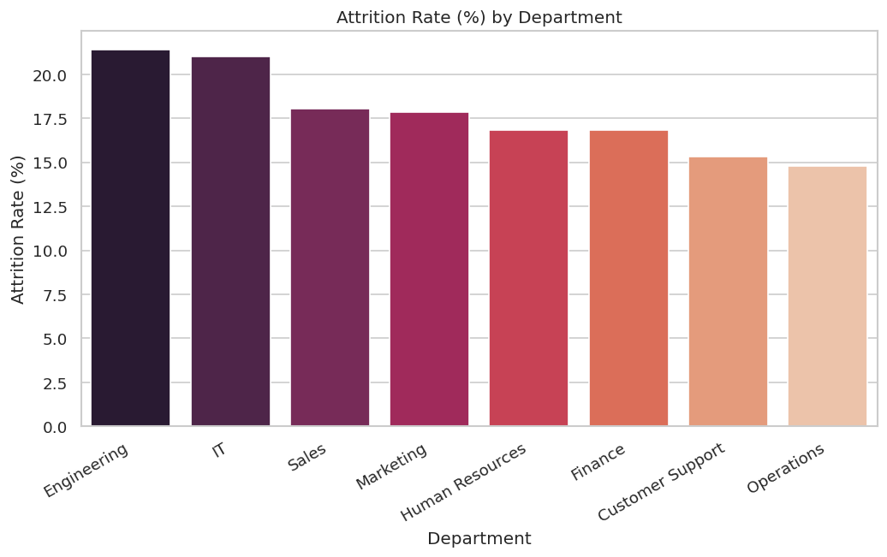
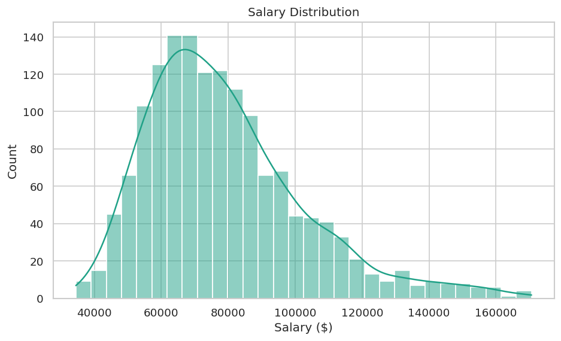
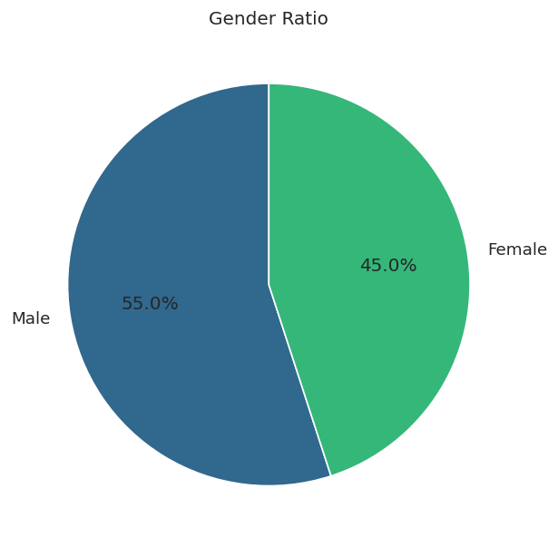
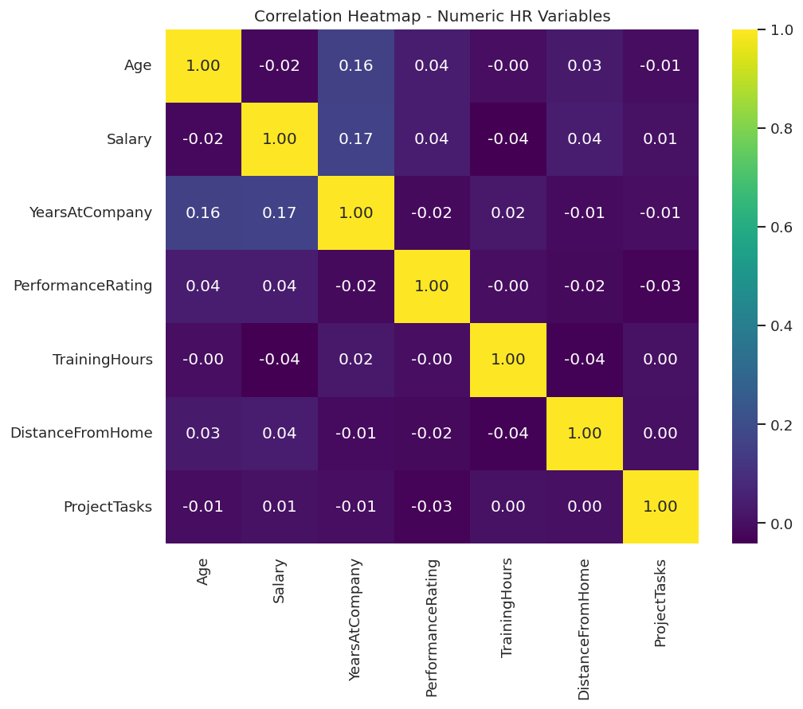

# HR Analytics Portfolio Project

An end-to-end HR Analytics project covering the full data workflow: **Python
data cleaning → Exploratory Data Analysis → normalized MySQL database → 35
SQL interview-level queries → Power BI executive dashboard**. Built as a
resume portfolio piece to demonstrate the complete analyst toolkit
on a realistic HR dataset (1,500 employees).


---

## Table of Contents
1. [Project Overview](#project-overview)
2. [Tech Stack](#tech-stack)
3. [Folder Structure](#folder-structure)
4. [Dataset](#dataset)
5. [Step 1 - Python Data Cleaning](#step-1---python-data-cleaning)
6. [Step 2 - Exploratory Data Analysis](#step-2---exploratory-data-analysis)
7. [Step 3 - MySQL Database Design](#step-3---mysql-database-design)
8. [Step 4 - Power BI Dashboard](#step-4---power-bi-dashboard)
9. [Business Insights Summary](#business-insights-summary)
10. [How to Run This Project](#how-to-run-this-project)
11. [Screenshots](#screenshots)


---


## Project Overview

This project simulates a real-world HR analytics engagement: a company
wants to understand **why employees are leaving, who gets promoted, how
compensation is distributed, and where department performance differs** -
then wants that analysis delivered as a reusable, interactive dashboard for
leadership. The project answers that brief using four layers:

| Layer | Tool | What it does |
|---|---|---|
| 1. Data Cleaning | Python + Pandas | Turns a messy raw export into an analysis-ready dataset |
| 2. Exploratory Analysis | Pandas + Seaborn + Matplotlib | Answers 9 core HR questions visually, with insights |
| 3. Database & Queries | MySQL | Normalized schema + 35 interview-style SQL queries |
| 4. Dashboard | Power BI | 6-page interactive executive dashboard with advanced DAX |

## Tech Stack

- **Python 3** - scripting, data cleaning, EDA orchestration
- **Pandas** - data wrangling, missing-value handling, feature engineering
- **Seaborn / Matplotlib** - statistical visualization
- **MySQL** - normalized relational database, schema design, querying
- **Power BI** - executive dashboarding, DAX measures, interactivity

## Folder Structure

```
HR-Analytics-Portfolio/
├── data/
│   ├── raw/
│   │   └── hr_data_raw.csv              # intentionally messy source data
│   └── processed/
│       ├── hr_data_cleaned.csv          # analysis-ready dataset
│       └── cleaning_log.txt             # step-by-step cleaning audit log
├── python/
│   ├── 00_generate_raw_data.py          # generates the raw synthetic dataset
│   ├── 01_data_cleaning.py              # full cleaning pipeline
│   ├── 02_eda_analysis.py               # EDA + chart generation
│   └── requirements.txt
├── sql/
│   ├── 01_schema.sql                    # normalized MySQL schema (7 tables)
│   ├── 02_data_import.py                # loads cleaned CSV into MySQL
│   ├── 03_interview_queries.sql         # 35 SQL interview-level queries
│   └── hr_analytics_full_dump.sql       # portable full DB dump (schema + data)
├── powerbi/
│   ├── DAX_Measures.md                  # every DAX measure, documented
│   └── Dashboard_Design_Guide.md        # page-by-page dashboard build guide
├── visuals/                             # 16 auto-generated EDA charts (PNG)
├── insights/
│   ├── business_insights.md             # written insight per analysis
│   └── department_summary.csv           # department-level KPI table
├── screenshots/
│   └── screenshots_list.md              # checklist of screenshots to capture
└── README.md
```

## Dataset

The dataset (`data/raw/hr_data_raw.csv`) is **synthetically generated** by
`python/00_generate_raw_data.py` with realistic relationships (e.g. higher
overtime + longer commute + low performance → higher attrition probability)
so every downstream analysis reflects genuine patterns rather than random
noise. It is intentionally seeded with common real-world messiness -
missing values, duplicate rows, inconsistent casing, mixed date formats,
and invalid outliers - so the cleaning step has real, demonstrable work to
do. Using generated data (instead of scraping a licensed dataset) also
means the entire project is 100% reproducible and safe to publish on
GitHub.

| Column | Description |
|---|---|
| EmployeeID | Unique employee identifier |
| Department | Department name (8 departments) |
| JobRole | Specific job title within department |
| Gender | Male / Female |
| Age | Employee age (18-60) |
| MaritalStatus | Single / Married / Divorced |
| Education | High School / Bachelor's / Master's / PhD |
| Salary | Annual salary (USD) |
| YearsAtCompany | Tenure in years |
| PerformanceRating | 1 (lowest) to 5 (highest) |
| TrainingHours | Annual training hours completed |
| DistanceFromHome | Commute distance (miles) |
| OverTime | Whether employee regularly works overtime |
| ProjectTasks | Number of active project tasks assigned |
| Promotion | Whether promoted in the current review cycle |
| Attrition | Whether the employee has left the company |
| HireDate | Date of hire |

**1,500 employees** after cleaning (1,520 raw rows including 20 injected
duplicates).

---

## Step 1 - Python Data Cleaning

Script: [`python/01_data_cleaning.py`](python/01_data_cleaning.py)

The pipeline runs 12 explicit, logged steps:

1. **Load & inspect** the raw CSV (1,520 rows x 17 columns).
2. **Standardize column names** (strip whitespace).
3. **Fix inconsistent casing/whitespace** in categorical text columns
   (e.g. `"MARKETING"`, `"marketing "`, `"Marketing"` → all become
   `"Marketing"`) using `.str.strip()` + `.title()`, with special handling
   so it doesn't mangle acronyms (`HR`, `IT`) or apostrophes (`Bachelor's`).
4. **Standardize Yes/No fields** - the raw data mixes `"Yes"/"No"` with
   `"Y"/"N"` for Attrition; all three Yes/No columns are mapped to a single
   consistent format.
5. **Parse mixed date formats** - `HireDate` contains both `YYYY-MM-DD` and
   `DD/MM/YYYY` strings; both are parsed into one standard `datetime` type.
6. **Handle missing values** - numeric columns (Salary, PerformanceRating,
   TrainingHours) are imputed using the **department median** (more
   accurate than a global median since these vary meaningfully by
   department); Age uses the overall median; categorical columns
   (Education, MaritalStatus) are imputed with the column **mode**.
7. **Remove duplicates** - 20 duplicate `EmployeeID` rows (simulating an
   accidental double export) are dropped, keeping the first occurrence.
8. **Validate & fix outliers** - ages outside 18-65 and salaries outside a
   realistic $1,000-$500,000 range (e.g. injected values like `-5`, `999`,
   `9999999`) are treated as invalid and replaced with the department
   median rather than dropped, to preserve sample size.
9. **Correct data types** - ints for counts/ratings, rounded floats for
   salary, proper `datetime` for HireDate.
10. **Feature engineering** - adds `SalaryBand`, `AgeGroup`, and
    `TenureGroup` bucketed columns used throughout the EDA and dashboard.
11. **Final validation** - asserts uniqueness of `EmployeeID`, clean
    Yes/No values, and zero unexpected remaining nulls before export.
12. **Export** - writes `data/processed/hr_data_cleaned.csv` plus a full
    `cleaning_log.txt` audit trail (every step's before/after counts) for
    transparency.

**Result:** 1,520 raw rows → **1,500 clean rows**, 17 → 20 columns
(3 engineered features added), 0 missing values, 0 duplicate IDs, 0
invalid outliers.

---

## Step 2 - Exploratory Data Analysis

Script: [`python/02_eda_analysis.py`](python/02_eda_analysis.py)

Generates 16 charts into `visuals/` and a written insight for each analysis
area into `insights/business_insights.md`. Covers all 9 required areas plus
a bonus correlation heatmap:

| # | Analysis | Chart(s) |
|---|---|---|
| 1 | Employee Distribution | Headcount by department |
| 2 | Gender Ratio | Pie chart |
| 3 | Salary Distribution | Histogram + boxplot by department |
| 4 | Age Distribution | Histogram |
| 5 | Department Analysis | Avg salary by department + summary table |
| 6 | Attrition Analysis | Overall, by department, by overtime |
| 7 | Performance Ratings | Distribution + by department |
| 8 | Promotion Analysis | Overall + by performance rating |
| 9 | Training Analysis | Distribution + vs attrition |
| Bonus | Correlations | Heatmap of numeric variables |

Every chart is immediately followed in the script by an auto-computed,
data-driven insight (not hardcoded text) - see
[`insights/business_insights.md`](insights/business_insights.md) for the
full write-up.

---

## Step 3 - MySQL Database Design

### Schema

[`sql/01_schema.sql`](sql/01_schema.sql) creates a **normalized (3NF)**
schema with 7 tables:

```
departments ──┐
              ├─< job_roles
education_levels ──┐
                    ├─< employees ─┬─< performance
                                   ├─< training_records
                                   └─< attrition_log
```

- **departments, job_roles, education_levels** - lookup/dimension tables,
  eliminating repeated text and enabling referential integrity.
- **employees** - core table, one row per employee, foreign-keyed to all
  three lookup tables.
- **performance** - one row per employee per review period (supports
  tracking performance over time, not just a single snapshot).
- **training_records** - one row per training event per employee (supports
  multiple trainings, not just a running total).
- **attrition_log** - one row per employee who has left, with exit date and
  reason, kept separate from `employees` so the core table stays lean.

Constraints (`CHECK`), indexes on frequently filtered columns
(`department_id`, `attrition`, `hire_date`), and `ON DELETE CASCADE` on
child tables are all included in the schema.

### Data Import

[`sql/02_data_import.py`](sql/02_data_import.py) loads
`hr_data_cleaned.csv` into all 7 tables in dependency order using
`mysql-connector-python`, building the lookup tables first and mapping
their generated IDs back onto the employee rows.

### SQL Query Bank (35 queries)

[`sql/03_interview_queries.sql`](sql/03_interview_queries.sql) - **every
query has been executed and validated against a live MySQL/MariaDB
database.** Grouped into 7 categories:

1. **Employee Count** (Q1-Q4) - totals, by department, by gender, active vs left
2. **Average Salary** (Q5-Q10) - overall, by department/role/education, top earners
3. **Department Performance** (Q11-Q14) - avg rating, combined KPI view, below-average depts
4. **Highest Attrition** (Q15-Q20) - by department, by overtime, by age group, early attrition
5. **Promotion Rate** (Q21-Q24) - overall, by performance, by department, exception checks
6. **Experience Analysis** (Q25-Q28) - avg tenure, tenure buckets, tenure-vs-pay, window functions
7. **Advanced/Misc** (Q29-Q35) - running totals, `RANK()`/window functions, second-highest salary,
   `HAVING`, correlated subqueries, pay-gap check

Techniques demonstrated: `JOIN`s across the normalized schema, `GROUP BY` +
`HAVING`, correlated and non-correlated subqueries, `CASE` bucketing,
window functions (`RANK()`, `SUM() OVER()`), and aggregate KPI patterns
commonly asked in SQL interviews.

---

## Step 4 - Power BI Dashboard

Documentation: [`powerbi/DAX_Measures.md`](powerbi/DAX_Measures.md) and
[`powerbi/Dashboard_Design_Guide.md`](powerbi/Dashboard_Design_Guide.md)

**6 pages:** Executive Dashboard · Employee Overview · Department Analysis
· Attrition Dashboard · Salary Dashboard · Performance Dashboard

**Core KPIs (as DAX measures):** Total Employees, Attrition Rate, Average
Salary, Promotion Rate, Average Experience, Average Performance Rating -
plus 20+ supporting measures for drill-downs, ranking, and formatting (full
list in `DAX_Measures.md`).

**Advanced features implemented and documented:**
- **Bookmarks** - "Reset View" on the Executive page; a By Department / By
  Tenure toggle on the Attrition page
- **Drillthrough** - Employee Overview → Department Analysis, filtered to
  the clicked department
- **Tooltips** - a custom Report Page Tooltip showing headcount, salary,
  attrition, and performance on hover over any department visual
- **Dynamic Cards** - a Field-Parameter-driven KPI card on the Executive
  page that switches metric on slicer selection
- **Conditional Formatting** - red/amber/green attrition-risk coloring,
  performance-rating coloring, pay-gap flags
- **Slicers** - Department, Gender, Age Group, OverTime, Tenure Group,
  Education, Job Role, synced across relevant pages

> A `.pbix` file is a binary Power BI project file - since it can't be
> authored directly in this text/code environment, the guide above
> documents the exact build steps, every DAX formula, and every page's
> layout so the dashboard is fully reproducible by opening Power BI
> Desktop, connecting to `data/processed/hr_data_cleaned.csv` (or the
> `hr_analytics` MySQL database), and following
> `Dashboard_Design_Guide.md` page by page.

---

## Business Insights Summary

Full write-up in [`insights/business_insights.md`](insights/business_insights.md).
Headlines:

- **Attrition is 17.7% overall**, and employees working overtime leave at
  **32.4%** vs **12.6%** for those who don't - overtime is the single
  strongest attrition risk factor in the dataset.
- **Engineering has both the highest average salary** (\$115,073) **and the
  highest attrition rate** (21.4%) - high pay alone isn't retaining staff
  in that department; work conditions (overtime, workload) likely matter
  more.
- **Promotion is meritocratic**: promotion rate climbs from 8.5% at
  performance rating 1 to 31.6% at rating 5.
- **43.9% of employees are high performers** (rating 4-5), with a
  company-wide average rating of 3.37/5.
- Department-level KPI table (headcount, avg salary, avg performance,
  attrition rate) is in
  [`insights/department_summary.csv`](insights/department_summary.csv).

---

## How to Run This Project

### 1. Python - Data Cleaning & EDA
```bash
cd python
pip install -r requirements.txt
python 00_generate_raw_data.py   # generates data/raw/hr_data_raw.csv
python 01_data_cleaning.py       # generates data/processed/hr_data_cleaned.csv
python 02_eda_analysis.py        # generates visuals/*.png + insights/
```

### 2. MySQL - Database & Queries
```bash
# Create the schema
mysql -u root -p < sql/01_schema.sql

# Create an app user (or reuse root) and grant access
mysql -u root -p -e "CREATE USER 'hr_user'@'localhost' IDENTIFIED BY 'your_password'; \
  GRANT ALL PRIVILEGES ON hr_analytics.* TO 'hr_user'@'localhost'; FLUSH PRIVILEGES;"

# Import the cleaned CSV into the normalized tables
export MYSQL_HOST=127.0.0.1 MYSQL_USER=hr_user MYSQL_PASSWORD=your_password
cd sql && python 02_data_import.py

# Run the query bank
mysql -u hr_user -p hr_analytics < 03_interview_queries.sql
```
Alternatively, restore the full portable dump directly:
```bash
mysql -u root -p -e "CREATE DATABASE hr_analytics;"
mysql -u root -p hr_analytics < sql/hr_analytics_full_dump.sql
```

### 3. Power BI - Dashboard
1. Open Power BI Desktop.
2. Get Data > connect to `data/processed/hr_data_cleaned.csv` or the
   `hr_analytics` MySQL database.
3. Follow `powerbi/Dashboard_Design_Guide.md` page by page, pasting DAX
   from `powerbi/DAX_Measures.md` into a `_Measures` table.

---

## Screenshots

See [`screenshots/screenshots_list.md`](screenshots/screenshots_list.md)
for the full checklist and embedding instructions. EDA chart previews:

| | |
|---|---|
|  |  |
|  |  |


## License
This project uses fully synthetic data generated for portfolio/educational
purposes. Free to fork, adapt, and reuse.
